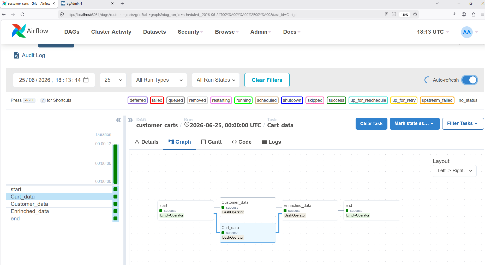
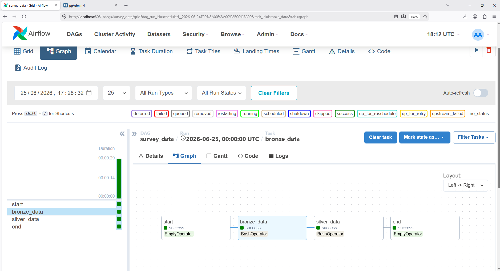

# Survey Data and Customer Cart Pipeline

## Overview

This project showcases end-to-end Data Engineering workflows through two mini-projects orchestrated with **Apache Airflow** and containerized using **Docker** for seamless deployment:

Customer Cart Pipeline : Extracts customer cart data from REST APIs, applies business transformations, and loads the processed data into PostgreSQL.

Survey Data Pipeline :Ingests survey data from local Excel files, applies data validation and transformations, and loads the structured output into PostgreSQL.


---

# Project Objectives

* Build an ETL pipeline that extracts customer cart data from external API endpoints and stores the processed data in PostgreSQL.
* Build a batch-processing pipeline that ingests survey responses from an Excel file and loads the cleaned data into PostgreSQL.

---
# Workflow outputs
## cusomer_cart workflow
Extract customer cart data from API endpoints. Perform data cleaning and transformation. Validate data quality. Load transformed data into PostgreSQL. Schedule and monitor the pipeline using Airflow.


## survey_data workflow
Read survey data from Excel. Clean and standardize records. Perform validation checks. Load processed data into PostgreSQL. Schedule and monitor execution with Airflow.



---

# Technologies Used

| Technology              | Purpose                            |
| ----------------------- | ---------------------------------- |
| Python                  | Data extraction and transformation |
| Apache Airflow          | Workflow orchestration             |
| PostgreSQL              | Metadata storage                   |
| Docker & Docker Compose | Containerized environment          |
| Excel file              | Data source                        |
| SQL                     | Querying stored podcast metadata   |
| Git & GitHub            | Version control                    |

---

# Running the Project

## Clone the repository

```bash
git clone https://github.com/giftdavid101/survey_data_and_CustomerCartPipeline
cd airflow-project
# start the environment
docker compose up --build
```
---
## Access Airflow
Once the containers are running, open the Airflow web interface and unpause the DAGs.

Login using the credentials configured in your Airflow environment.

```
http://localhost:8080

```
## Access Pgadmin
- Open the pgAdmin web interface.
- Create and configure a new server connection.
- Set the Host name/address to postgres (this is the default hostname defined in the docker-compose.yml file).
- If you changed the PostgreSQL service name or hostname in your Docker Compose configuration, use the hostname you configured instead.

---

# Author

**Gift David**

Aspiring Data Engineer passionate about building scalable data pipelines, workflow automation, and analytics solutions.

Feel free to connect or explore my other projects.
